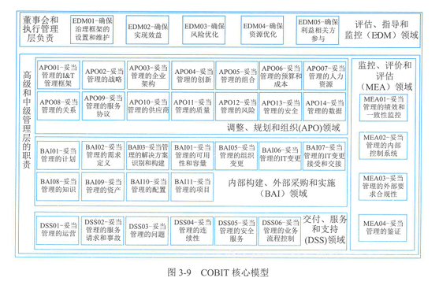

# 信息系统治理  

> 3.1.1 IT治理基础
> 3.1.2 IT治理体系
> 3.1.3 IT治理任务
> 3.1.4 IT治理方法和标准
***

## 知识点  

**信息系统治理（IT治理）**：是组织开展信息技术及其应用活动的重要观看手段，也是组织治理的重要组成部分。IT治理起到了重要的统筹、评估、指导和监督作用。信息技术审计（IT审计）作为与IT治理配套的组织管控手段，是IT治理不可或缺的苹果和监督工具，重点承担这组织信息系统发展的合规性检测以及信息技术风险管控等职能。  

**IT治理**：是描述组织采取有效的机制对信息技术和数据资源开发利用，平衡信息化发展和数字化转型过程中的风险，确保实现组织的战略目标的过程。  

**制定IT资源统一规划问题**：

    1.信息系统应用已有相当的基础，但是多年来分散开发或引进的信息系统，形成了许多“信息孤岛”，缺乏共享、网络化的信息资源。  

    2.信息资源整合目标空泛，没有整合“信息孤岛”的措施，数据中心建设和数据集中管理等规范缺乏可操作性，尤其缺少数据标准化建设方面的建设规划。  

**驱动组织开展高质量IT治理的因素**：

    1.良好的IT治理能够确保组织IT投资有效性；

    2.IT属于知识高度密集型领域，其价值发挥弹性较大；

    3.IT已经融入组织管理、运行、生产和交付等各领域中，成为各领域高质量发展的重要基础；

    4.信息技术的发展演进以及新型信息技术的引进，可谓组织提供大量新的发展空间和业务机会；

    5.IT治理能够推动组织充分理解IT价值，从而促进IT价值挖掘和融合利用；

    6.IT价值不仅仅取决于好的技术，也需要良好的价值管理，场景化的业务融合应用；

    7.高级管理层的管理幅度有限，无法深入到IT每项管理中，需要采用明确责任权利和清晰管理去确保IT价值；

    8.成熟度较高的组织以不同的方式治理IT，获得了领域或行业领先的业务发展效果。

**IT治理的内涵**：

    1.IT治理作为组织上层管理的一个有机组成不服，由组织治理层或高级管理层负责，从组织全局的高度对组织信息化与数字转型与数字化转型做出制度安排，体现了治理层和最高管理层对信息相关活动的关注；

    2.IT治理强调数字目标与组织战略目标保持一致，通过对IT的综合开发利用，为组织战略规划提供技术或控制方面的支持，以保证相关建设能够真正落实并贯彻组织业务战略和目标；

    3.IT治理保护利益相关者的权益，对风险进行有效管理，合理利用IT资源，平衡成本和收益，确保信息系统应用有效，即使地满足需求，并获得期望的收益，增强组织的核心竞争力；

    4.IT治理是一种制度和机制，主要涉及管理和制衡信息系统与业务战略匹配，信息系统建设投资、信息系统安全和信息系统绩效评价等方面的内容；

    5.IT治理组成部分包括管理层、组织结构、制度、流程、人员、技术等多个方面，共同构建完善的IT治理架构，达到数字战略和支持组织的目标。  

**IT治理主要目标**：与业务目标一致、有效利用信息与数据资源、风险管理。

    1.与业务目标一致：IT治理要从组织目标和数字战略中抽取信息与数据需求和功能需求，形成总体的IT治理框架和系统整体模型，为进一步系统设计和实施奠定基础，保证信息技术开发利用跟得上持续变化的业务目标。

    2.有效利用信息与数据资源：同意IT治理对信息与数据资源的管理职责进行有限管理，保证投资的回收，并支持决策。

    3.风险管理：IT治理重视风险管理，通过制定信息与数据资源的保护级别，强调对关键信息与数据资源，实施有效监控和事件处理。

**IT治理的管理层次**：

    总体战略目标：从上而下贯彻执行，治理层主要集中在最高管理层和管理执行层。

    三层管理层次：最高管理层、执行管理层、业务与服务执行层。

    主要职责：

        最高管理层：证实IT战略和业务战略是否一致；证实通过明确的期望和衡量手段交付IT价值；指导IT战略、平衡支持组织当前和未来发展的投资；指导信息和数据资源的分配。  

        执行管理层：制定IT目标；分析新技术的机遇和风险；建设关键过程与核心竞争力；分配责任、定义规程、衡量业绩；管理风险和获得可靠保证等。  

        业务与服务执行层：信息和数据服务的提供和支持；IT基础设施的建设和维护；IT需求的提出和响应。  

**IT治理体系**：

    IT治理核心：关注IT定位和信息化建设与数字化转型的责权利划分。  

    IT治理体系具体构成：

        IT定位：IT应用的期望行为与业务目标一致；

        IT治理架构：业务和IT在治理委员会中的构成、组织IT与各分支机构的IT全责边界等；

        IT治理内容：投资、风险、绩效、标准和规范等；

        IT治理流程：统筹、评估、知道、监督；

        IT治理效果：内外评价等。

    IT治理关键决策：IT原则、IT架构、IT基础设施、业务应用需求、IT投资和优先顺序。

        IT原则驱动着IT整体架构的形成，IT架构又决定着基础设施，基础设施所确定的能力又决定着基于业务需求应用的构建，最后IT投资和优先顺序必须要为IT原则、整体架构、基础设施和业务需求所驱动。  

**IT治理体系框架**：以组织的战略目标为导向，架起组织战略和IT桥梁，实现IT风险的全面管理以及IT资源的合理利用。  

    具体包括：IT战略目标、IT治理组织、IT治理机制、IT治理域、IT治理标准和IT绩效目标等部分。  

        IT战略目标：IT战略目标是指为实现IT价值和目标，使组织从IT投入中获得最大收益、而针对IT与业务关系、IT决策、IT资源利用、IT风险控制等方面制定的目标。  

        IT治理组织：IT治理组织是界定组织中各相关主体在各自方面的治理范围、责权利及其相互关系的准则，核心是治理机构的设置和权限的划分。  

        IT治理机制：IT治理机制是IT治理决策、执行机制、风险控制机制、协调机制的综合体。  

        IT治理域：IT治理域是在IT治理的规则之下，对组织的IT资源进行整合与配置，根据IT目标所采取的行动。  

        IT治理标准：包括IT治理基本规范、IT治理实施参考、IT治理评价体系和IT治理审计方法等方面，作为组织实施IT治理最佳实践和对照依据。  

        IT绩效目标：IT绩效目标关注IT价值的实现，评价IT规划与IT构建过程中是否满足业务需求以及构建过程中的工期、成本、质量是否打到目标。  

**IT治理的核心内容**：

    IT治理本质上关心：

        1.实现IT的业务价值；

        2.IT风险的规避；

        前者通过IT与业务战略匹配实现，后者通过在组织内部建立相关职责实现。

    IT治理的核心内容：

        1.组织职责；

        2.战略匹配；

        3.资源管理；

        4.价值交付；

        5.风险管理；

        6.绩效管理。

**IT治理机制经验**：

    建立IT治理机制原则：简单、透明、适合。

    主要经验：

        1.吸纳有才干的业务经理、使之负责阻值范围的IT治理决策，并在IT原则中加入严格的成本控制。

        2.谨慎管理组织的IT架构和业务架构，降低业务成本。

        3.设计严格的架构例外处理流程，使昂贵的例外最小化，并可以从中不断学习。

        4.建立集中化的IT团队，用于管理基础设施、架构和共享服务。

        5.应用链接IT投资和业务需求的流程，既可以增加透明度，又可以权衡中心和各运营部门或团队的需求。

        6.设计需要对IT投资进行集中协作和核准的IT投资流程。

        7.设计简单的费用分摊和服务水平协议机制，以明确分配IT开支等。

**IT治理任务**：

    组织的IT治理活动定义为统筹、知道、监督和改进
        
        统筹现在和未来的IT战略和组织规划、管理和绩效的实施计划、策略；
        指导IT管理实施、绩效考评、风险控制和业务合规；
        监督IT与业务的一致性、复合型及IT应用的合规性；
        改进IT战略规划、组织策略、信息系统全生命周期和数据治理。

    开展组织IT治理活动主要任务在五个方面：

        1.全局统筹：统筹规划IT治理的目标范围、技术环境、发展趋势和人员责权利。

            重点：

                1.制定满足可持续发展的IT蓝图；

                2.实施科学决策、集约管理的策略，实现横向的业务集成和纵向的业务管控；通过内外部的监督，确保IT与业务的一致性和适用性；

                3.建立适应内外部信息变化的持续改进和创新机制。

        2.价值导向：价值导向包括基于实现有效利益，确保预期收益清晰理解，明确实现收益的问责机制。

            重点：

                1.认可信息技术、信息系统和数据在组织中的价值；

                2.识别投资目录，并以相应的方式进行评估和管理；

                3.对关键指标进行设定和监督，并对变化和偏差做出及时回应；

                4.权衡实施成本与预期效益并随组织内外部环境的变化及时调整。

        3.机制保障：机制保障是指组织应对自身IT发现进行有效管控，保证IT需求与实现的协调发展，并是IT安全和风险得到有效的识别、管理、防范和处置。

            重点：

                1.指导建立规范过程管理和痕迹管理，并向利益相关者公开质量设计举措；

                2.评审IT管理体系的适宜性、充分性和有效性；

                3.审计IT完整性、有效性和合规性；

                4.监督由审计和管理评审，提出改进内容的实施。

        4.创新发展：创新发展是指利用IT创新开拓业务领域，提升管理水平，改进质量、绩效和降低成本，确保实现战略目标的灵活性和对环境变化的适应性。

            重点：

                1.创造基于业务团队与IT团队的深度沟通以及对内外部环境感知和学习的技术创新环境；

                2.确保技术发展、管理创新、模式革新的协调联动；

                3.对组织创新能力进行评估，并对关键创新要素进行分析和评估；
                
                4.通过促进和创新有效抵御风险，并确保创新是组织文化的组成部分。

        5.文化助推：文化助推是指组织和利益相关者沟通IT治理的目标、策略和职责，营造积极向上、沟通包容的组织文化。

            重点：

                1.建立与IT发展相适应的组织文化发展策略；

                2.营造包括知识、技术、管理、情操在内的积极向上的文化氛围；

                3.根据组织内部环境变化，评估并改进组织文化的管理。

**IT治理方法与标准**：典型：IT治理系列标准、信息和技术治理框架（COBIT）、IT治理国际标准（ISO/IEC 38500）

    通用要求：

        1.建立组织的IT治理体系，并实施自我评价；

        2.开展信息技术审计；

        3.研发、旋转和评价IT治理相关的软件或解决方案；

        4.第三方对组织的IT治理能力进行评价。

    该标准下的IT治理模型包含：治理的内外部要求、治理主体、治理方法以及信息技术及其应用的管理体系。

    该标准下的IT治理框架包括：信息技术顶层设计、管理体系和资源三大治理域。

    COBIT：对治理和管理进行明确区分

        治理确保利益干系人的需求、条件和旋转方案进行评估，以确定全面均衡、达成共识的组织目标；通过确定优先级扥估计和制定决策来设定方向；根据议定的方向和目标监控绩效与合规性；

        管理是按治理设定的方向计划、构建、运行和监控活动，以实现组织目标。

**COPIT治理和管理目标**：

    治理目标被列入评估、指导和监控（EDM）领域

    管理目标分为四个领域：

        1.调整、规划和组织（APO）针对IT的整体组织、战略和支持活动；

        2.内部构建、外部采购和实施（BAI）针对IT姐姐方案的定义、采购和实施以及它们到业务员流程的整合；

        3.交付、服务和支持（DSS）针对IT服务的运营交付和支持、包括安全；

        4.简历、评价和评估（MEA）对阵IT的性能监控及其与内部性能目标、内部控制和外部要求的一致程度。

**治理系统组件**：

    1.流程：流程描述了一组为实现某种目标而安排有序的实践和活动，并生成了一组支持实现整体IT相关目标的输出内容。

    2.组织架构：组织架构是组织的主要决策实体。

    3.原则、政策和程序：用于将理想行为转化为日常管理的实用指南。

    4.信息：在任何组织中，人心无处不在，包括组织生成和使用的全部信息。COBIT侧重有效运转组织治理系统所需的信息。

    5.文化、道德和行为：个人和组织的文化、道德和行为作为治理和管理活动的成功因素，其价值往往被低估。

    6.人员、技能和胜任能力：人员、技能和胜任能力对做出正确决策、采取纠正行动和成功完成所有活动是必不可少的。

    7.服务、基础设施和应用程序：服务、基础设施和应用程序包括为组织提供IT处理治理系统的基础设施、技术和应用程序。

**组织开展治理系统设计的流程**：了解组织关键和战略，确定治理系统的初步范围，优化治理系统的范围，最终确定治理系统的设计。

**IT治理国际标准原则**：责任、战略、收购、性能、一致性、人的行为。  

    该标准规定治理机构通过评估、指导和监督三个任务来治理IT。

        评估：治理机构应审查和判断当前和未来的使用，包括计划、建议和供应安排。

        指导：治理机构应负责战略和政策的编制和执行。

        监督：治理机构应通过适当的测量系统来检测IT的表现。
