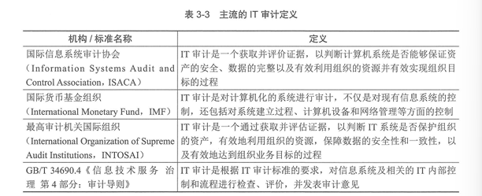
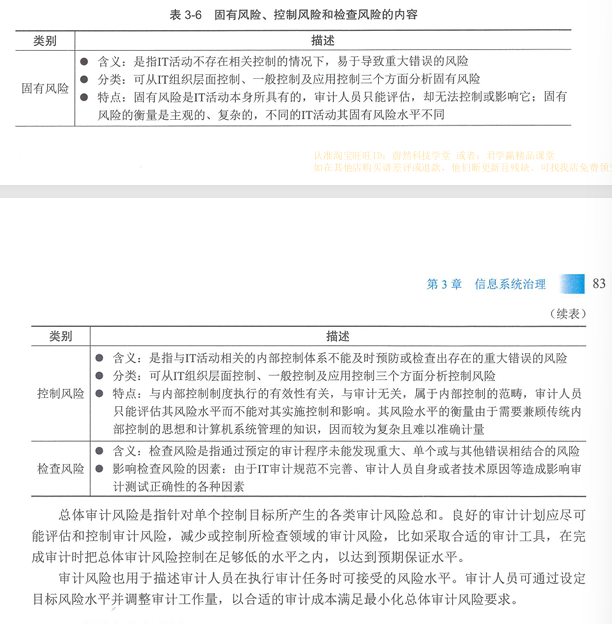
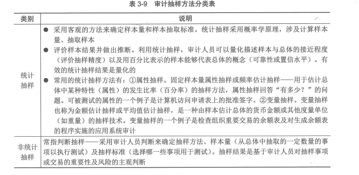

# 信息系统治理  

> 3.1.1 IT审计基础
> 3.1.2 IT审计方法与技术
> 3.1.3 IT审计流程
> 3.1.4 IT审计内容
***

## 知识点  

**IT审计定义**：

**IT审计目的**：通过开展IT审计工作，了解组织IT系统与IT活动的总体状况，对组织是否实现IT目标进行审查和评价，充分识别与评估相关IT风险，提出评价意见及改进意见，促进组织实现IT目标。

**IT审计范围**：需要根据审计目的和投入的审计成本来确定。

    实际实践：先对组织与信息系统相关的总体情况进行了解和风险评估，确定主要IT风险，然后根据确定的风险来判断那些控制、流程对组织的影响比较大，并结合审计项目的实践、配审的审计力量来确定重点审计范围。

**IT审计人员**：对审计人员要求职业道德、知识、技能、资格与经验、专业胜任能力及利用外部专家服务等方面。

**IT审计风险**：主要包括固有风险、控制风险、检查风险和总体审计风险。

**IT审计依据和准则**：

    1.信息系统审计准则（ISACA，国际信息系统审计协会发布）  

    2.《内部控制-整体框架》报告(COSO，美国虚拟财经报告委员会下属发起人委员会报告)

    3.信息及相关技术控制目标（COBIT，国际通用的信息及相关技术控制规范）

**IT审计常用方法**：IT审计方法就是为了完成IT审计任务所采取的手段。常用有访谈法、调查法、监察法、观察法、测试法和程序代码检查法等。  

**IT审计技术**：包括风险评估技术、审计抽样技术、计算机辅助审计技术及大数据审计技术。  

**风险评估技术**：

    风险识别技术：用以识别可能影响一个或多个目标的不确定性，包括德尔菲法、头脑风暴法、检查表法、SWOT技术及图解技术等。

    风险分析技术：是对风险影响和后果进行评价和估量，包括定性分析和定量分析。

    风险评价技术：是在风险分析的基础上，通过相应的指标体系和评价标准，对风险成都进行划分，以揭示影响成败的关键风险因素，包括担风险风险评价和总体风险评价。

    风险应对技术：IT技术体系中为特定风险制定的应对技术方案，包括云技术、冗余链路、冗余资源、系统弹性伸缩、两地三中心灾备、业务熔断限流等。

**审计抽样技术**：是指审计人员在实施审计程序是，从审计对象总体中选一定数量的样本进行测试，并根据测试结果，推断审计对象总体特征的一种方法。
  

**计算机辅助审计技术（CAAT）**：指审计人员在审计过程和审计管理活动中，以计算机为工具来执行和完成某些审计程序和任务的有一种新型审计技术。  

**大数据审计技术**：运用大数据技术方法和技术，利用数量巨大、来源分散、格式多样的数据，开展夸层级、跨系统、跨部门、跨业务等深入挖掘和分析，提升审计发现问题、评价判断、宏观分析的能力。

    包括：大数据智能分析技术、大数据可视化分析技术、大数据多数据源综合分析技术等。

**IT审计证据**：审计证据是审计机构和审计人员获取，用于确定所审计实体或数据是否遵循既定标准或目标，形成审计结论的证明材料。

    审计证据的特性是指审计证据内在的性质和特征，具体表现在为审计人员围绕这些性质和特征手机审计证据时应达到的基本要求。

    特性：充分性、客观性、相关性、可靠性、合法性。

**IT审计底稿**：是指审计人员对制定的审计计划、实施的审计程序、获取的相关审计证据，以及得出的审计结论做出的记录。

    审计底稿是审计证据的载体，是审计人员在审计过程中形成的审计工作记录和获取的资料。

    作用：
        1.是形成审计结论、发表审计意见的直接依据；

        2.是评价考核审计人员的主要依据；

        3.是审计质量控制与监督的基础；

        4.对未来审计业务具有参考备查作用。

    一般分为综合类工作底稿、业务类工作底稿、备查类工作底稿。

**审计流程**：是指审计人员在具体审计过程中采取的行动和步骤。

    作用：
        1、有效地知道审计工作；

        2、有利于提高审计工作效率；

        3、有利于保证审计项目质量；

        4、有利于规范审计工作。

    审计流程一般有广义和狭义之分：
        狭义：指审计人员在取得审计证据、完成审计目标、得出审计结论过程中所采取的步骤和方法。

        广义：指审计机构和审计人员对审计项目从开始到结束整个过程所采取的系统性工作步骤，一般分为审计准备、审计实施、审计终结及后续审计四个阶段。

            审计准备：是指IT审计项目从计划开始，到发出审计通知书为止的期间。是起点和基础。
                工作：
                    1、明确审计目的及任务；
                    2、组建审计项目组；
                    3、搜集相关信息；
                    4、编制审计计划。

            审计实施阶段：是审计人员将项目审计计划付诸实施的期间。是审计的中心环节。
                工作：
                    1、深入调查并调整审计计划；
                    2、了解并初步评估IT内部控制；
                    3、进行符合性测试；
                    4、进行实质性测试。

            审计终结阶段：是整理审计工作底稿、总结审计工作、编写审计报告、做出审计结论的期间。
                工作：
                    1、整理与符合审计工作底稿；
                    2、整理审计证据；
                    3、评价相关IT控制目标的实现；
                    4、判断并报告审计发现；
                    5、沟通审计结果；
                    6、出具审计报告；
                    7、归档管理。

            后续审计阶段：是在审计报告发出后的一定时间内，审计人员为检查被审计单位对审计问题和建议是否已经采取了适当的纠正措施，并取得预期效果的跟踪审计。

**审计内容**：
    审计业务和服务工作分为IT内部控制审计和IT专项审计。

    IT内部控制审计主要包括：组织层面IT控制审计、IT一般控制审计、应用控制审计；

    IT专项审计主要是根据当前面临的特殊风险或者需求开展的IT审计，审计范围为IT综合审计的某一个部分或几个部分。