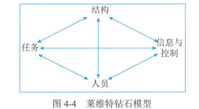
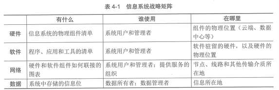
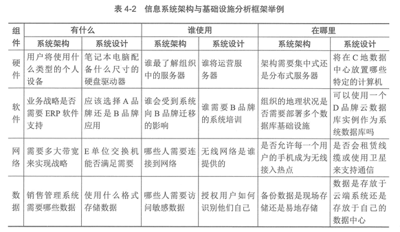

# 信息系管理  

> 4.1.1 管理基础  
> 4.1.2 规划和组织  
> 4.1.3 设计和实施  
> 4.1.4 运维和服务  
> 4.1.5 优化和持续改进
***

## 知识点  

**信息系统**：是信息进行采集、处理、存储、管理和检索，形成组织中的信息流动和处理，必要时能向有关人员提供有用信息的系统。是由人、技术、流程和数据资源组成的人机系统。

    目的：及时、正确地收集、加工、储存、传递和提供信息，以实现组织中各项活动的管理、调节和控制。

    四个要素：人员、技术、流程、数据。

    信息系统的层级架构：信息系统之上是管理，监督系统的设计和结构，并监控其整体性能。同时组织管理层制定信息系统层应满足的业务续签和业务战略。

**信息系统管理覆盖四大领域**：

    1、规划和组织：针对信息系统的整体组织、战略和支持活动。

    2、设计和实施：针对信息系统解决方案的定义、采购和实施，以及他们与业务流程的整合。

    3、运维和服务：针对信息系统服务的运行交付和支持，包括安全。

    4、优化和持续改进：针对信息系统的性能监控及其于内部性能目标、内部控制目标和外部要求的一致性管理。

**信息系统的规划和组织**：需要根据组织的发展目标和其他相关因素规划信息系统的战略、组成、建设、运行和运营等。目标是通过实施具备一致性的管理方法，满足业务对信息系统的管理需求。规划和组织的相关内容涵盖信息系统所需的所有组件。

**信息系统战略三角**：业务战略、信息系统、组织机制。  

**业务战略**：阐明了组织寻求业务目标以及期望如何达成的路径。是组织传达宣示其目的的方法。

    总成本领先战略：组织的目标是成为市场上成本最低的生产者，通过最大限度地降低成本，从而获得高于平均水平的绩效。所提供的产品或服务必须在质量上与业内其他人提供的产品或服务相当，以便客户对象方便感知其相对高性价比。 

    差异性战略：组织通过差异化，以一种在市场上显得独特的方式，定义其产品或服务。组织确定那些定性维度对其客户对象最重要，然后与找到在其中一个或多个维度增加产品和服务价值的方法。

    专注化战略：专注化允许组织将其范围限制在更狭窄的细分市场，并为该组客户对象量身定制其产品，该策略两种变体：1、专注成本，在其细分市场内寻求成本优势；2、专注差异化，寻求细分市场内的产品或服务的差异化。

**组织机制战略**：组织机制战略包括组织的设计以及定义、设置、协调和控制其工作流程未作出的选择。  

    钻石模型将组织技术的关键组成部分标识为信息与控制、人员、结构和任务。

    新时代的组织，其组织机制战略的成功执行包括组织、控制和文化的变量的最佳组合。

        组织变量：决策权、业务流程、正式报告关系和非正式沟通网络。

        控制变量：数据的可得性、规划的性质和质量、业绩计量和评价制度的有效性以及做好工作的激励措施。

        文化变量：构成组织的价值观。

**信息系统战略**：是组织用来提供信息服务的计划。信息系统支撑组织实施其业务战略。业务战略是关于竞争（服务对象想要什么，竞争做什么），定位（组织想以什么方式竞争）和能力（公司能做什么）的功能。  

**信息系统设计和实施**：首先将业务需求转化为信息系统架构，然后再将该架构转化为信息系统设计。  

    从战略到系统架构：组织从业务战略开始，使用该战略制定更具体的目标。然后从每个目标派生出详细的业务需求。组织需要与架构设计人员合作，将这些业务需求转化为构成信息系统架构要求、标准和流程的更详细视图。这个更详细视图，即是信息系统架构要求。  

    从系统架构到系统设计：将信息系统架构转化为系统设计，需要继承信息系统架构并添加更多细节，包括实际的硬件、数据、网络和软件。进而扩展到数据的为止和访问过程、防火墙的为止、链路规范、互联设计等。信息系统架构被转化为功能规格。功能规格可分为硬件规格、软件规格、存储规格、接口规格、网络规格等，然后决定如何使用这些规范，并在信息系统基础架构韩总使用什么硬件、软件、存储、结构、网络等。

        信息系统居多个级别：
            1、全局级别可能侧重于整个组织，并构成整个组织的信息环境；
            2、组织间级别信息系统则为跨组织边界的服务对象、供应商或其他利益干系人的沟通交流奠定基础；
            3、应用级信息系统是在考虑特性业务应用是，通常重点考虑的数据库和程序组件，以及它们运行的设备和操作环境。

    转化框架：转化框架将业务战略转化为信息系统架构进而转变为信息系统设计，转化框架提出来三类问题：内容、人员和位置，需要为每个信息系统组件回答这些问题。
    
        内容：需要回答组件是什么，并确定特定类型的基数等；
        人员：旨在了解相关组件涉及哪些个人、团体和部门；
        为止：信息系统的设计和构建可能跨越了多个位置使用组件，需要了解所有内容各自的位置。

**架构模式**：信息系统体系架构常见三种模式

    集中式架构：集中式架构下所有内容采用集中建设、支持和管理的模式，其主体系统通常部署在数据中心，以消除管理物理分离的基础设施带来的困难。

    分布式架构：硬件、软件、网络和数据的部署方式是在多台小型计算机、服务器和设备之间分配处理能力和应用功能，这些设施严重依赖网络将它们连接在一起。

    面向服务的系统架构（SOA）：SOA架构中使用的软件通常被引向软件及服务（SaaS）相关架构，同事，这些应用程序在通过互联网交付时也被称为Web服务。
    
**信息系统的运维和服务**：从信息系统运行的视角进行整合性的统筹规划，包括对信息系统、应用程序和基础实施的日常控制进行综合管理，以有效支持组织目标达成和流程实现。  

    主要包括：运行管理和控制、IT服务管理、运行与监控、终端侧管理、程序库管理、安全管理、介质控制和数据管理等。

**运行管理和控制**：IT团队发生的所有活动都应收管理和控制。操作人员执行的所有操作和活动，都应是受管理层批准的控件、过程和项目的一部分。过程和项目都应具有足够的记录保存，以便管理层能够了解这些活动的状态。  

    管理信息系统运维的管理控制主要活动包括：

    1、过程开发：操作人员执行的重复性活动应以过程的形式记录下来，需要开发、审查和批准面熟每个过程及其每个步骤的相关文档，并将其提供给运营人员。  

    2、标准制定：从执行任务的方式到所使用的技术，采用标准化定义和约束，从而有效的推动信息系统运行相关工作的一致性。

    3、资源分配：管理层分配支持信息系统运行的各项能力，包括人力、技术和资源。资源分配应与组织的使命、目标和目的保持一致。

    4、过程管理：应测量和管理所有信息系统运行的相关过程，确保过程在时间上的预算目标内被正确和准确的执行。

**IT服务管理**：IT服务管理是通过主动管理和流程的持续改进来确保IT服务交付且有效的一组活动。

    IT服务管理主要活动包括：

    1、服务台：服务台是组织体现IT服务的重要环节，也是服务干系人体验的重要感知窗口。

    2、事件管理：事件是IT服务管理遭遇计划外中断或服务质量出现下降，以及尚未影响服务的配置项故障。  

    3、问题管理：当发生几个看起开相同或相似根本原因的事件时，就会启动问题管理活动。问题管理的总体目标是减少事件的数量和严重性，这种对事件的控制既包括发生事件后被动性措施，也包括采取主动措施预防与容量相关的事件发生。

    4、变更管理：变更是是一个或更多信息系统配置项的状态发生改变的行动。主要目的是确保信息技术环境的所有建议更改都经过适用性和丰县管控的审查，并确保变更不会相互干扰，也不会干扰其他计划内或计划外的活动。

    5、配置管理：配置管理是通过技术或者行政手段对信息系统的信息进行管理的一系列活动，这些信息不仅包括信息系统的具体配置信息，还包括这些配置项之间的相互关系。

        配置项通常包括：硬件详细信息、硬件配置、操作系统版本和配置、软件版本和配置。

        配置管理核心工作：识别、记录、封信配置项信息，主要包含配置管理数据库的建立以及配置数据管理数据库的维护，以支持信息系统的正常运行。

    6、发布管理：发布管理负责计划和实施信息系统的变更，并且记录该变更的各方面信息。

    7、服务级别管理：服务级别管理就是对IT服务的级别进行定义、记录和管理，并在可接受的成本之下与干系人达成一致的管理过程，通过服务水平协议、服务绩效监控、和报告的不断循环，持续维护和改进服务质量，以及触发采取行动消除较差服务，从而满足干系人的服务需求。

    8、财务管理：IT服务财务管理是负责对IT服务运作过程中所有资源尽显财务管理的流程。

        主要活动包括：预算编制、设备投资、费用管理、项目会计和项目投资回报率管理。

    9、容量管理：容量管理用于确认信息系统有足够的容量满足服务需求。

        主要活动：定期策略、计划变更、战略优化和技术变化等。
        三个子过程：业务容量管理、服务容量管理、资源容量管理。

    10、服务连续性管理：服务连续性管理是一组与组织持续提供服务的能力相关的活动，主要发生在自然或认为灾难时连续保持服务有效性的活动。

        主要活动：服务连续性管理的治理、业务影响分析、制定和维护服务连续性计划、测试服务连续性计划、响应与恢复。

    11、可用性管理：可用性管理是有关设计、实施、监控、评价和报告IT服务的可用性以确保持续地满足服务干系人的可用性需求的服务管理流程。

**运行与监控**：有效地IT运行要求IT人员按照既定流程和过程理解并正确执行任务。同时，IT运行还强调对人员进行培训，以有效识别异常和错误，并做出正确反应。

    IT运行的任务包括：

        1、按照计划执行作业；

        2、监控作用，并按照优先级为作业分配资源；

        3、重新启动失败的作业和进程；

        4、通过加载或变更备份介质，或通过确保目标的存储系统就绪来优化备份作业；

        5、监控信息系统、应用程序和网络的可用性，保证这些系统具备足足够的性能；

        6、实施空闲期的维护活动，如设备清洁和系统重启。

    运维监控：IT团队应对信息系统、应用程序和基础设施进行监控，以确保它们按要求运行。

    安全监控：组织需要执行不同类型的安全监控，并把安全监控放在其整体战略的一部分，以防御和响应安全事件。

**终端侧管理**：TI团队职能的一个关键环节是它向组织人员提供的服务，已改善他们对IT访问和使用的情况。组织通常通过IT管理工具来促进用户终端计算机的高效和一致的管理。

**程序库管理**：程序库是组织用来存储和管理应用程序源代码和目标代码的工具。

    程序库通常作为具有用户界面和多种功能的信息系统存在 
    