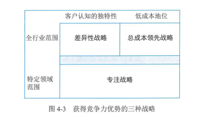

# 信息系管理  

> 4.1.1 管理基础  
> 4.1.2 规划和组织  
> 4.1.3 设计和实施  
> 4.1.4 运维和服务  
> 4.1.5 优化和持续改进
***

## 知识点  

**信息系统**：是信息进行采集、处理、存储、管理和检索，形成组织中的信息流动和处理，必要时能向有关人员提供有用信息的系统。是由人、技术、流程和数据资源组成的人机系统。

    目的：及时、正确地收集、加工、储存、传递和提供信息，以实现组织中各项活动的管理、调节和控制。

    四个要素：人员、技术、流程、数据。

    信息系统的层级架构：信息系统之上是管理，监督系统的设计和结构，并监控其整体性能。同时组织管理层制定信息系统层应满足的业务续签和业务战略。

**信息系统管理覆盖四大领域**：

    1、规划和组织：针对信息系统的整体组织、战略和支持活动。

    2、设计和实施：针对信息系统解决方案的定义、采购和实施，以及他们与业务流程的整合。

    3、运维和服务：针对信息系统服务的运行交付和支持，包括安全。

    4、优化和持续改进：针对信息系统的性能监控及其于内部性能目标、内部控制目标和外部要求的一致性管理。

**信息系统的规划和组织**：需要根据组织的发展目标和其他相关因素规划信息系统的战略、组成、建设、运行和运营等。目标是通过实施具备一致性的管理方法，满足业务对信息系统的管理需求。规划和组织的相关内容涵盖信息系统所需的所有组件。

**信息系统战略三角**：业务战略、信息系统、组织机制。  

    业务战略：阐明了组织寻求业务目标以及期望如何达成的路径。是组织传达宣示其目的的方法。

    总成本领先战略：组织的目标是成为市场上成本最低的生产者，通过最大限度地降低成本，从而获得高于平均水平的绩效。所提供的产品或服务必须在质量上与业内其他人提供的产品或服务相当，以便客户对象方便感知其相对高性价比。 

    差异性战略：